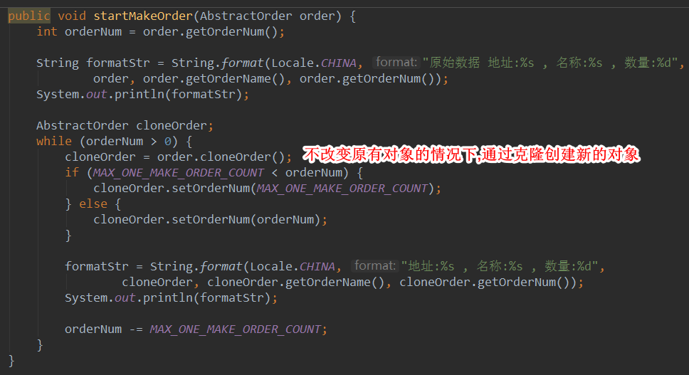
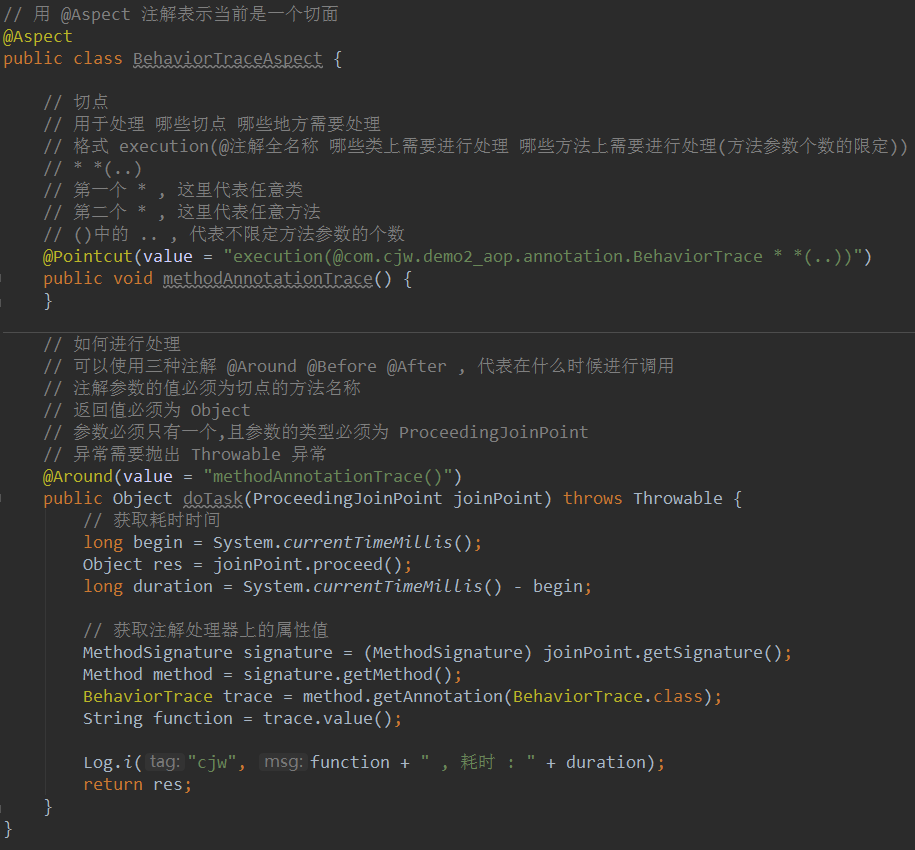

# 原型模式

### 定义

- 用原型的实例指定创建的种类，并通过拷贝这些原型创建新的对象

### 目的

- 保护最原始的那一份存档，隐藏复制过程

### 示例

# 注解的使用

# AOP 面向切面编程

## 定义

- 是一套所有架构师（不限语言）都必需掌握的技术，主要应用于全局业务

## 常见使用场景

- 性能检测
- 用户权限验证 (普通权限,会员权限...)
- 资源的统一释放
- 用户行为统计

## 配置

### 导入 Jar 包

- Android 端需要使用 aspectjrt.jar

### gradle (app.gradle) 配置

	// aspectj 配置
	buildscript {
	    repositories {
	        mavenCentral()
	    }
	    dependencies {
	        classpath 'org.aspectj:aspectjtools:1.8.8'
	        classpath 'org.aspectj:aspectjweaver:1.8.8'
	    }
	}

	// 为了使用 Log , 需要引用下面的代码
	import org.aspectj.bridge.IMessage
	import org.aspectj.bridge.MessageHandler
	import org.aspectj.tools.ajc.Main
	
	final def log = project.logger
	final def variants = project.android.applicationVariants
	
	variants.all { variant ->
	    if (!variant.buildType.isDebuggable()) {
	        log.debug("Skipping non-debuggable build type '${variant.buildType.name}'.")
	        return;
	    }
	
	    JavaCompile javaCompile = variant.javaCompile
	    javaCompile.doLast {
	        String[] args = ["-showWeaveInfo",
	                         "-1.8",
	                         "-inpath", javaCompile.destinationDir.toString(),
	                         "-aspectpath", javaCompile.classpath.asPath,
	                         "-d", javaCompile.destinationDir.toString(),
	                         "-classpath", javaCompile.classpath.asPath,
	                         "-bootclasspath", project.android.bootClasspath.join(File.pathSeparator)]
	        log.debug "ajc args: " + Arrays.toString(args)
	
	        MessageHandler handler = new MessageHandler(true);
	        new Main().run(args, handler);
	        for (IMessage message : handler.getMessages(null, true)) {
	            switch (message.getKind()) {
	                case IMessage.ABORT:
	                case IMessage.ERROR:
	                case IMessage.FAIL:
	                    log.error message.message, message.thrown
	                    break;
	                case IMessage.WARNING:
	                    log.warn message.message, message.thrown
	                    break;
	                case IMessage.INFO:
	                    log.info message.message, message.thrown
	                    break;
	                case IMessage.DEBUG:
	                    log.debug message.message, message.thrown
	                    break;
	            }
	        }
	    }
	}

## 使用

### 定义注解

### 使用注解

### 定义切面

