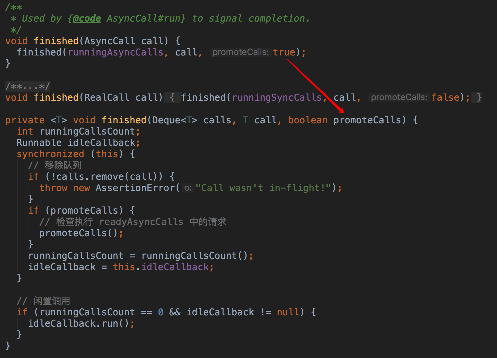
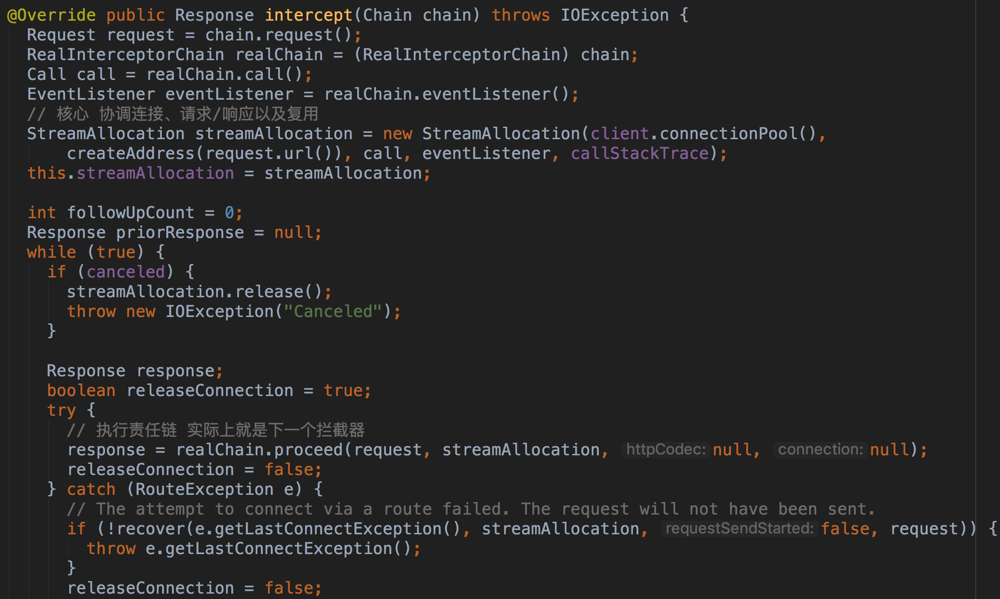

# OkHttp源码分析

## 使用

## 源码分析

### OkHttpClient的初始化

### Request的构建

### newCall方法

### enqueue方法

### 调度器 Dispatcher

通过线程池执行AsynCall任务,通过上述分析,然后调用到AsyncCall中的execute方法

### AsyncCall中execute方法

### 队列的移除与添加

### 执行请求的核心方法 getResponseWithInterceptorChain

### RetryAndFollowUpInterceptor拦截器

- 如果开发者没有指定拦截器,那么集合中的第一个元素为RetryAndFollowUpInterceptor拦截器
- 主要负责重试机制与重定向

### BridgeInterceptor拦截器

- 处理请求头及请求体

### CacheInterceptor拦截器

- 处理缓存配置 根据条件(存在响应缓存并被设置为不变的或者响应在有效期内)返回缓存响应
- 设置请求头(If-None-Match、If-Modified-Since等) 服务器可能返回304(未修改)

### ConnectInterceptor拦截器

- 负责连接

